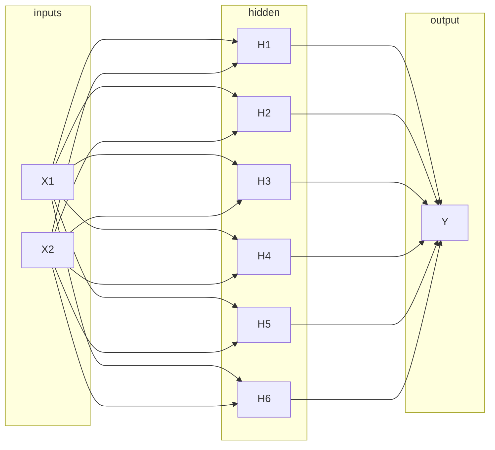
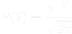
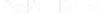
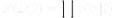

# Bayesian Neural Networks

## **Model**:

A bayesian MLP model with stochastic weights and deterministic activation layers has been implemented.
The activation used at every node is _sigmoid_

Following is the structure of the model:

We sample the weights of this model using 2 approaches and compare them:

1. Metropolis Hasting's
2. Random sampling

---

## **Metropolis Hastings:**

The prior is selected to be the a standard normal distribution  

For the likelihood, we have:

Using this sampling technique, a set of sampled weights is generated. Using this set, the accuracy is calculated.

The accuracy reached is: **85%**

---

## **Random Sampler**

The accuracy reached is: **50%**

---

## Summary

- The performance of the random sampler is expected. Since weights are being sampled at random without any thought, it's just guessing the output.

- Using MCMC to sample the posterior pushes the accuracy to over 85% consistently.

- The model can be fine tuned in various ways such as increasing the width of the hidden layer, increasing the number of hidden layers etc. The model's accuracy can exceed 90% by making these changes.

- The model's accuracy can be further increased by changing the prior to include more task specific information.
