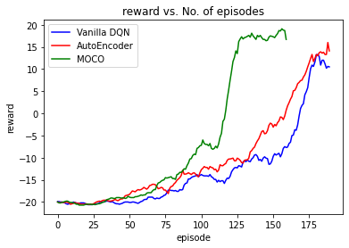

# Reinforcement Learning

This is an analytical study on different approaches of increasing the sample efficient of Deep Q Networks.

An already existing [DQN Implementation](https://github.com/KaleabTessera/DQN-Atari) already exists which is used as the baseline for my comparison.

In addition to this, 2 "improvoments" have been tried out:

1. Autoencoder
2. Self Supervised Learning

The purpose of these 2 models is to introduce an additional learning signal to the base model in an effort to improve the sample efficiency.

The loss calculated during training consists of 2 parts:

1. Base model loss
2. representation loss (Additional training signal)

Since the purpose of this study is to compare _sample efficiencies_ of the approaches, the "Base model loss" is kept unchanged and only the representation loss part is tinkered.

In each of the approaches, the encoder is kept unchanged as this is responsible for the Base model loss.
The "nature" model is used as the base model.

> Deep Q Networks perform very poorly in sample efficiency. Hence they are very slow to train especially when the dimention of the observation space is high.
>
> Atari games with visual input have a very high dimention observation space and hence training them to achieve comparable performance takes couple of hours. Hence the following analysis is only conduced on _Atari Pong_

---

## **Vanilla DQN**

### **Model**

The model consists of 2 parts.

- First the high dimentional input is encoded via the encoder into a "meaningful" representation of a lower dimentional vector. A vector of 512 dimentions is used to capture the features. This vector is **not** disentangled. Future works can study the effect of disentangled representation.
- This vector is then passed through a small fully connected layer to recieve the final policy vector.

### **Results**

This is our baseline model. The results are found in base_results.

The model starts to win from epoch #175

---

## **AutoEncoder**

> New files added are:
>
> - dqn/model_autoencoder
> - dqn/agent_autoencoder

### **Model**

This model consists of 3 parts:

- Encoder network same as vanilla DQN
- Policy network same as vanilla DQN
- Decoder network

The decoder network takes the out of the encoder network as input and tries to recreate the image. MSE loss of the input image and the recreate image is taken as the representation loss.

This additional loss essentially forces the model to make the encoded vector a better representation of the image. The main idea behind this is that if the encoded vector is a good representation of the image, it contains all the information contained in the image and hence should be able to recreate the image.

### **Results**

The model performs slightly better than the baseline model. This is due to the above reasons.

The model starts winning from around epoch #150
The performance is better but no so much

---

## **Self Supervised Learning**

> New files added are:
>
> - dqn/model_simclr
> - dqn/agent_simclr
>
> - dqn/model_moco
> - dqn/agent_moco
>
> - dqn/model_barlow
> - dqn/agent_barlow

<br />

> I have created models for simclr, moco and barlow but the analysis is done with only moco

## **MOCO**

### **Model**

This model consists of 3 parts:

- Encoder network same as vanilla DQN
- Policy network same as vanilla DQN
- Momentum encoder

The structure of the momentum encoder is the same as the encoder network.

Methods using contrastive loss train the encoder by getting differnt encoded vectors from different augmentation of the same image. Since the encoded vectors are essentially fromed from the same image, they must be similar to each other.

Common similarity metrics are:

- cosine similarity
- bilinear product

### **Results**

This model has a significant better result than the other approaches.

The model reward shoots up at epoch #110 and is already winning by epoch 120. This is a significant better result than the other approaches.
This proves that contrastive learning improves the model result by a log

---

## Combined results



---

## **Running this program**

**Create a new environment**

```bash
conda create -n gym
```

**Install the dependencies**

```bash
pip install -r requirements.txt
```

**Install atari environments and roms**

```bash
pip install gym[atari]
pip install autorom
AutoRom
```

**To use `gym.wrappers.Monitor` to record the agent**

```bash
sudo apt-get install ffmpeg
```

**To continue training form a checkpoint**

```bash
python train_atari.py --load-checkpoint-file path/to/checkpoint.pth
```

**To run vanila DQN**

```bash
python train_atari.py
```

**To run AutoEncoder model**

```bash
python train_atari.py --set-representation autoencoder
```

**To run SimCLR model**

```bash
python train_atari.py --set-representation simclr
```

**To run MOCO model**

```bash
python train_atari.py --set-representation moco
```

**To run Barlow Twins model**

```bash
python train_atari.py --set-representation barlow
```
